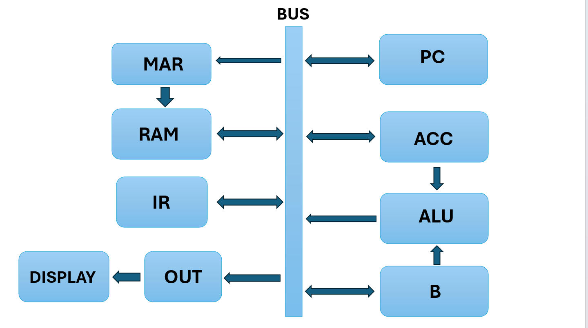
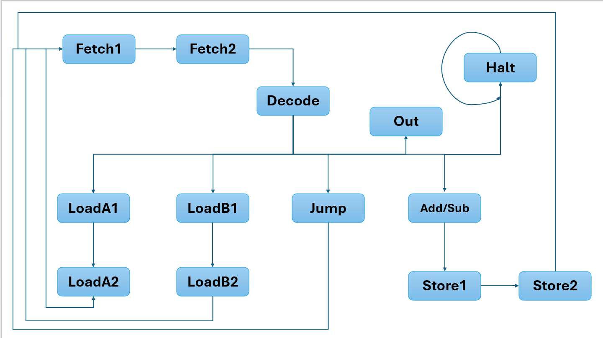
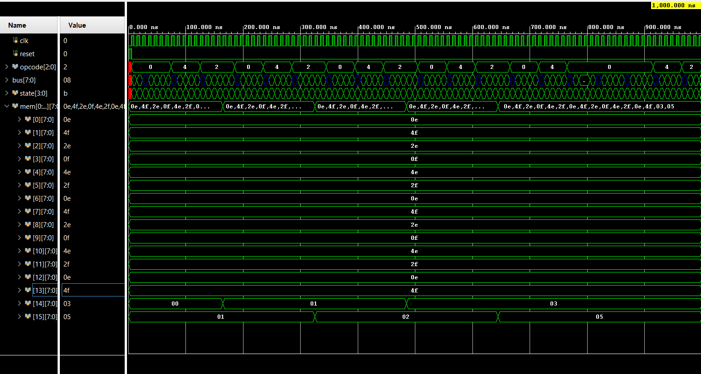

# *8-bit CPU 
 A custom 8-bit CPU build in verilog - starting from individual logic gates to full datapath and a micro-coded Control Unit, simulated and verified in AMD Xilinx Vivado

 ## Modules

 |**Module Name**|**Function**|
 | :--- | :--- |
 |4-bit ALU| An ALU which takes in two 4-bit inputs and perform operation like sum,difference,product and division. It is driven by an always-live ALU_out wire in the `bus_system`.|
 |Bus System| A tri-state shared bus_system which regulates the registers `ACC` and `B`.|
 | RAM | A synchronous 16*8-bits `RAM` which stores 16 memory elements each of 8-bits(1 byte).It has a reading and writing mode and takes address as input when `switch`= 0 and takes a value as input when `switch`= 1|
 |Program Counter| Sends the address of the program that is to be executed to the RAM. It has a few allowed functions like `jump`,`reset` and of course `auto_increment`.|
 |Instruction Register| Stores the value passed by the RAM in reading mode. The value stored is then passed on to the bus with upper 3 bits sliced to give the op code and the lower remaining bits for the operand on which the operation is to be done|
 |Control Unit| A `FSM` following the `Moore's` model which decides which next state is to be executed after the current state. The state only depends on the input and not the output.

 ## Instruction Set

 |**OPcode**|**Instruction**|**States**|
 | :--- | :--- | :--- |
 |000|Load into ACC| LoadA1->LoadA2|
 |001|Store into ACC and RAM| Store1->Store2|
 |010|Use ADD from ALU| ADD->Store1|
 |011|Use SUB from ALU| SUB->Store1|
 |100|Load into B| LoadB1->LoadB2|
 |101|Jump to desired Address|Jump->Fetch1|
 |110|Output the value on Bus|Out|
 |111|Halt the program|Halt->Halt|

## Ideas worth noting
* The `ALU` never reads from the bus, instead it has an always-live wire attached to it which drives the bus when we need `ALU's` value using `alu_drive`.
* `RAM` access takes up two States - Whenever we have to use `RAM` in the process we have to make it two cycle for eg.`(LoadA1 and LoadA2)` because `RAM` reads address which is to be used in one cycle and in the next cycle it puts the required value onto the bus.
* `ADD/SUB` automatically stores the value so that the programs stored in RAM are used efficiently.This saves up space by not including the `STORE's` program in the RAM.
* The Fibonacci series is implemented by using the two registers`ACC` and `B` so we can't see the full fibonacci but rather in a zig-zag manner of the two memory address i.e. mem[14] and mem[15].

## DataPath Diagram

## States Diagram

## Simulation Results
### Image:

### Video:

## Tools Used:
* AMD Xilinx Vivado
* Verilog HDL
